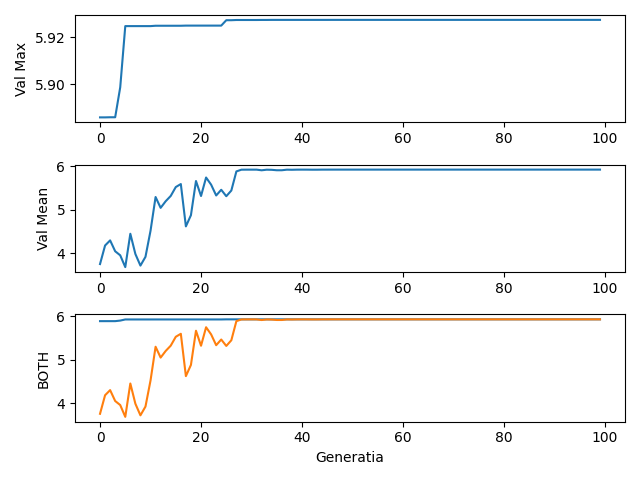
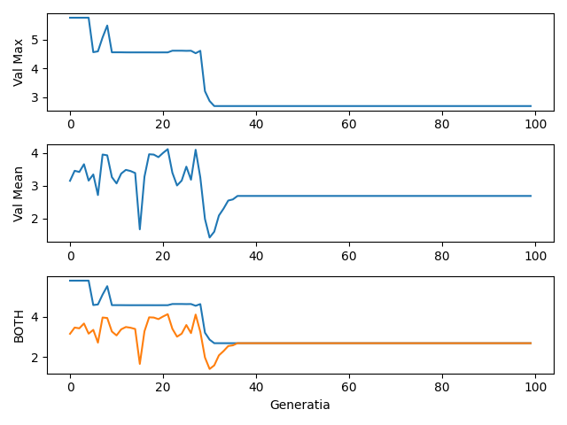

# Genetic Algorithm Optimization

This repository contains an implementation of a genetic algorithm for optimization purposes. The algorithm aims to find the maximum value of a given *quadratic* function by evolving a population of individuals over multiple generations.

## Algorithm Overview

The genetic algorithm follows the following steps:

1. Prompt the user to specify whether an elitist element should be included in the population.
2. Read input values from the "input.txt" file to configure the algorithm.
3. Define the objective function to be maximized.
4. Determine the number of bits required for encoding the individuals based on the precision and range of possible values.
5. Generate the initial population by randomly selecting individuals within the given range and encoding them.
6. Iterate over the specified number of generations.
   - Perform selection using roulette wheel selection.
   - Create a new population through crossover and mutation operations.
   - Evaluate the fitness of the new population.
7. Store the evolution progress in the "evolutie.txt" file.
8. Plot the evolution of the maximum and average values over generations using matplotlib.
           
## Graphs 

The following graphs illustrate the evolution of the maximum and average values over generations:

With the elite individual:


Without the elite individual:

## Getting Started

To run the genetic algorithm and visualize the results, follow these steps:

1. Clone the repository:

   ```shell
   git clone https://github.com/your-username/genetic-algorithm-optimization.git

2. Install the required dependencies:
    ```shell 
   pip install matplotlib

4. Prepare the input file:
Create a file named "input.txt".
Specify the required input values in the following format:
   ```shell
    <population_size>
    <interval_limit_left> <interval_limit_right>
    <a> <b> <c> <d_>
    <precision>
    <cross_over_probability>
    <mutation_probability>
    <number_of_generations>
                                   

5. Run the algorithm:
   ```shell
   python3 main.py